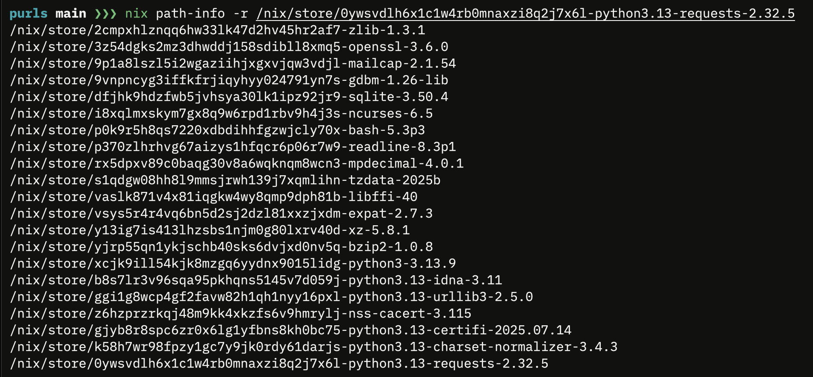
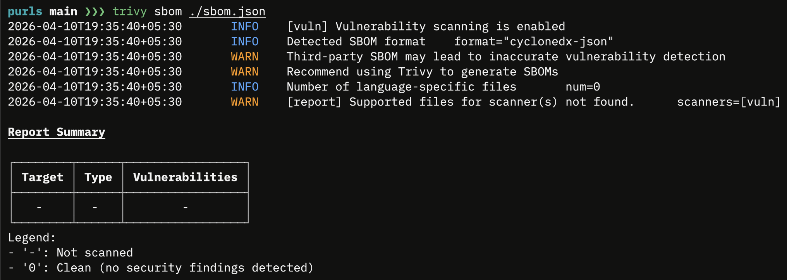
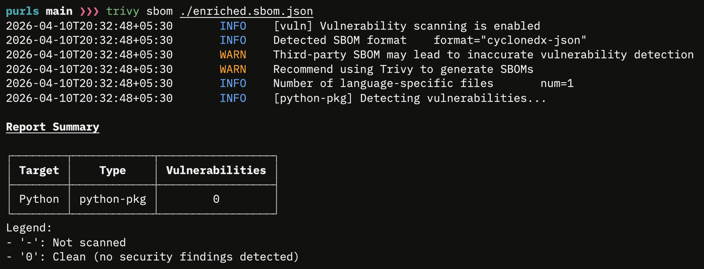

# PURL enrichment trial

Goal is to prove that enrichment would be helpful to get accurate SBOMs. Accurate SBOMs would help in downstream tasks. One such task is vulnerability scanning the app developed/built using nixpkgs.

## Method

1. Generate the SBOM using `sbomnix` and run it through `trivy sbom ./sbom.json` to detect vulnerabilities
2. Enrich the generated SBOM itself and run it through the `trivy sbom ./enriched.sbom.json` again.


## target pkg: python3Packages.requests

> ![NOTE]
> target pkg chose based on lesser transitive dependencies.
python3Packages.requests 



with corresponding store path: `/nix/store/0ywsvdlh6x1c1w4rb0mnaxzi8q2j7x6l-python3.13-requests-2.32.5`

## Before enrichment



## after enrichment



### cmd for quick look at enriched PURLs

```zsh
diff ./enriched.sbom.json sbom.json
```

### Responsible disclosure of use of AI
[extract_meta_position.py](./extract_meta_position.py) to get the default.nix paths for the closure.
```zsh
python3 extract_meta_position.py
```